# 项目概述
本项目为网易云音乐的Angular实现，为本人Angular学习练手之作，后端采用 .net core webapi提供数据，本部分源代码为前端部分，完整的git版本日志位于vsts上。
工作繁忙，更新不及时，请见谅
 
附个人入门资料 [资料](./src/Angular5Practice.pdf)
## 演示地址(请在现代浏览器下使用)
首次加载可能耗时较长，请理解 
国内：http://home.cqbn.xyz:1080
 
国外: https://www.cqjtu.xyz

# 如何运行
1、git clone项目源代码 
2、npm install 
3、ng serve --proxy-config proxy.config.json
 
# 反馈
欢迎交流 t1246539858@outlook.com
# 项目部分截图

主页
 
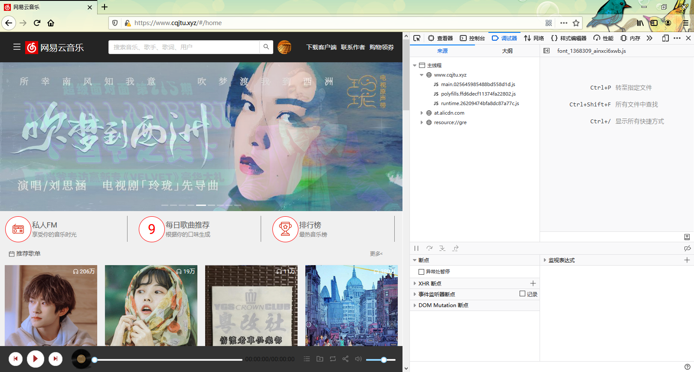
注册
 
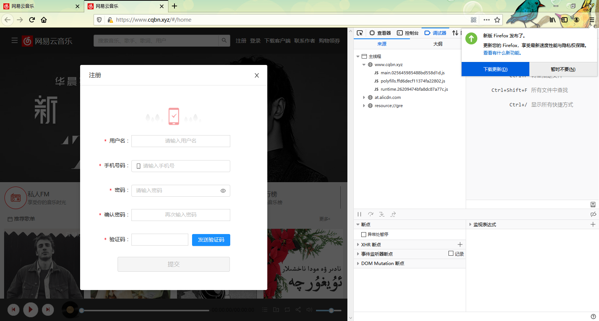
 
登录
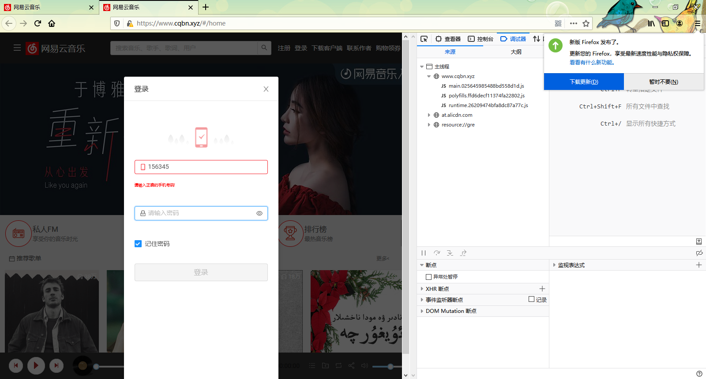
 
每日推荐
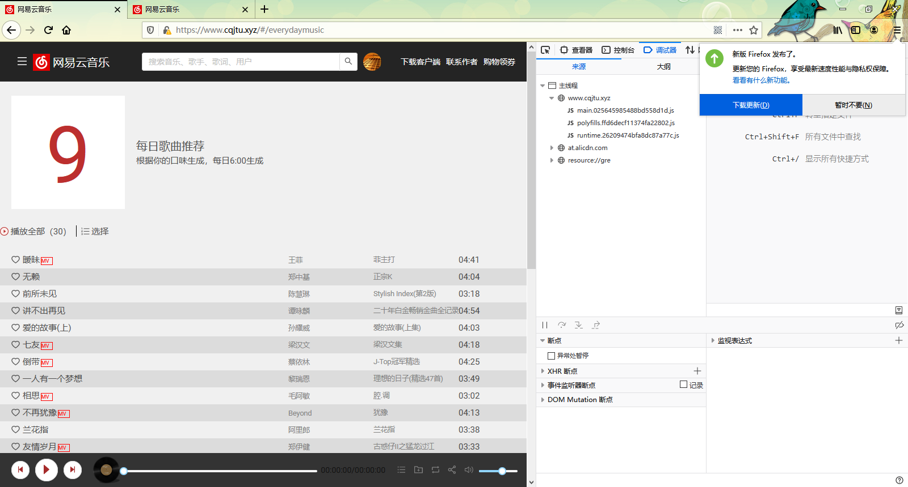
 
私人FM

 
播放面板
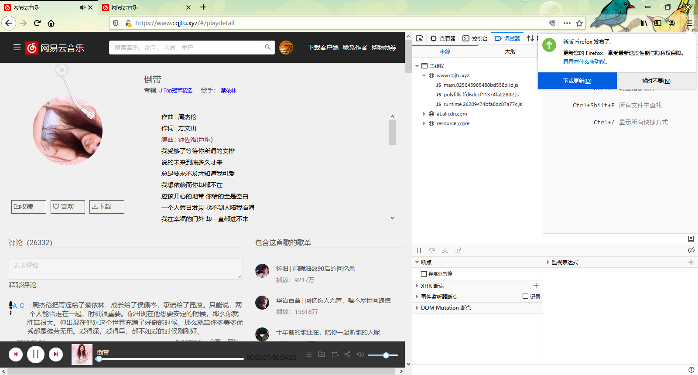
 
发送评论
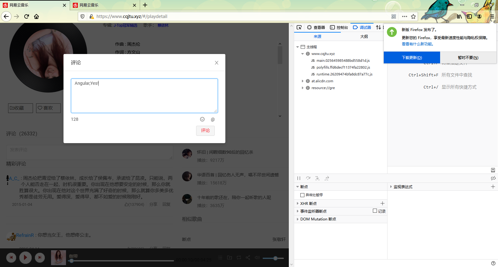
 
歌单
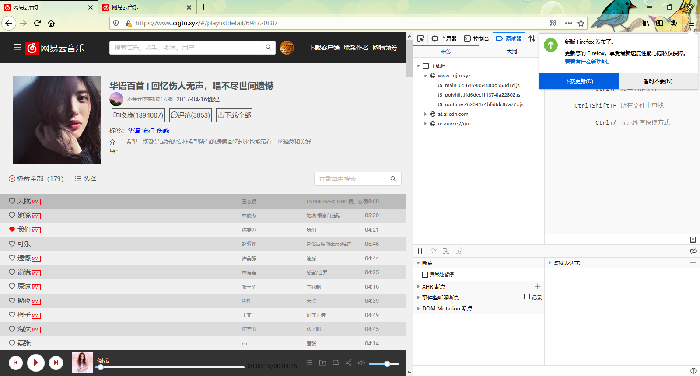
  
歌手详情
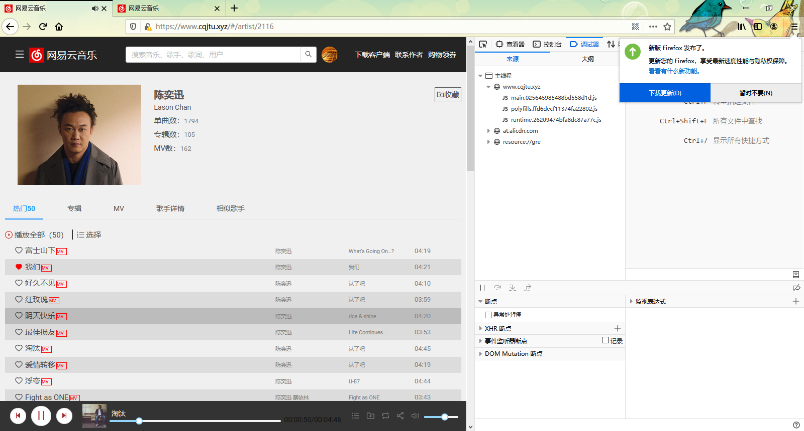
  
专辑详情
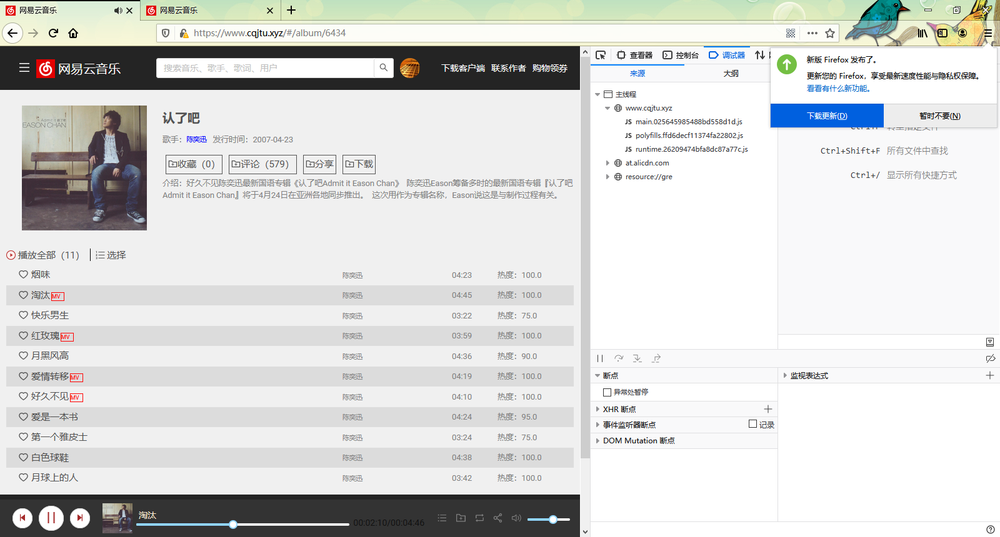
  
他人主页
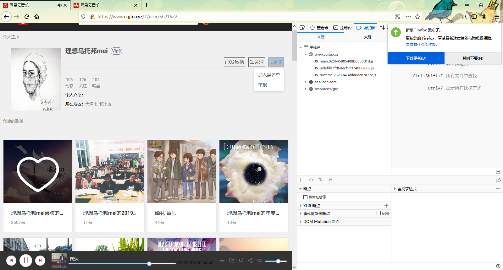
  
Mv
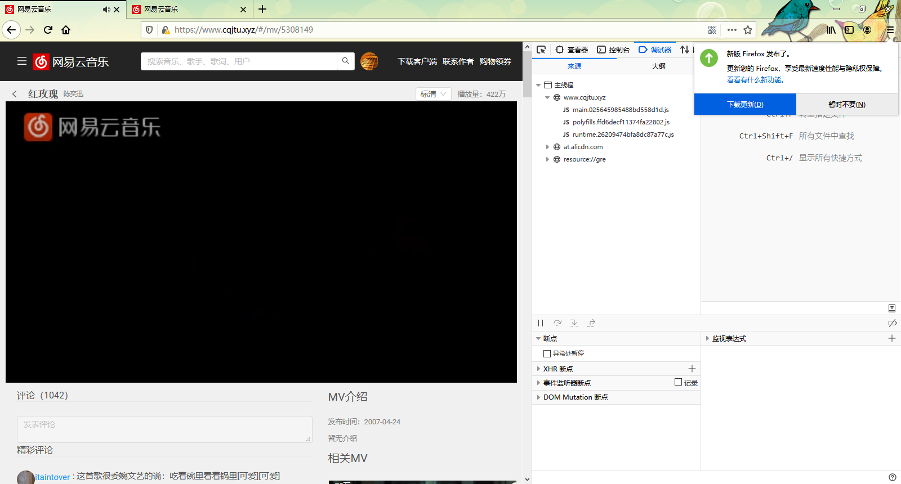
  
歌单编辑
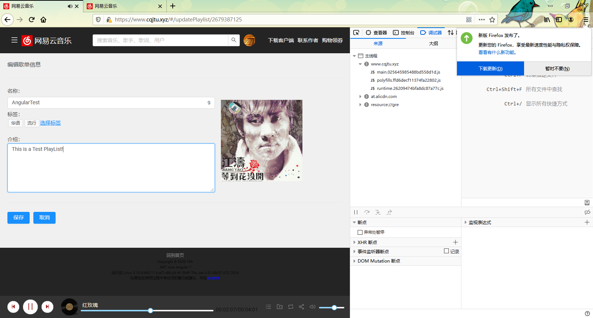
  
个人云盘
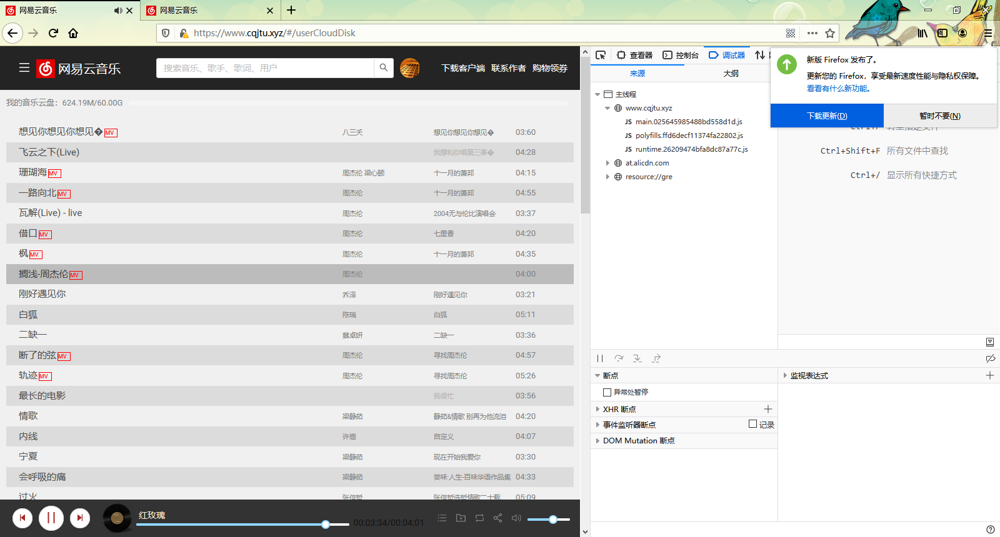
  
个人动态
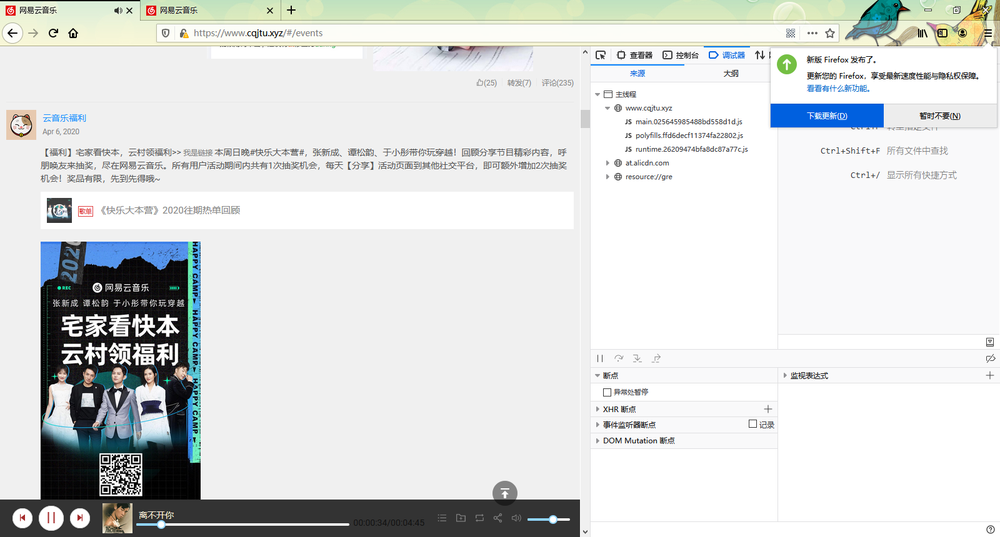
 
歌单分类
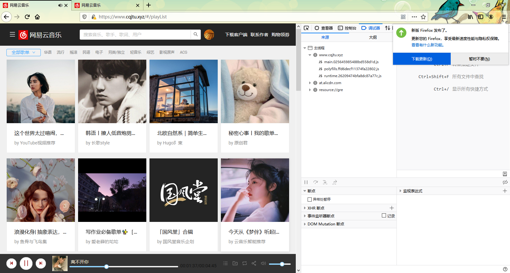
 
歌手分类
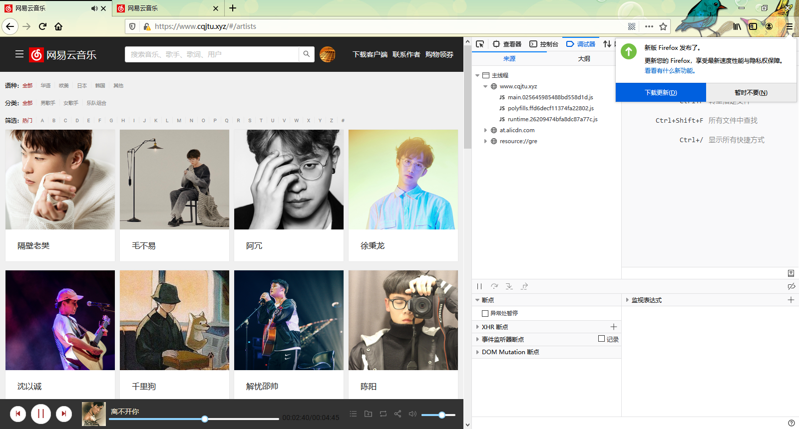
 
更改个人信息
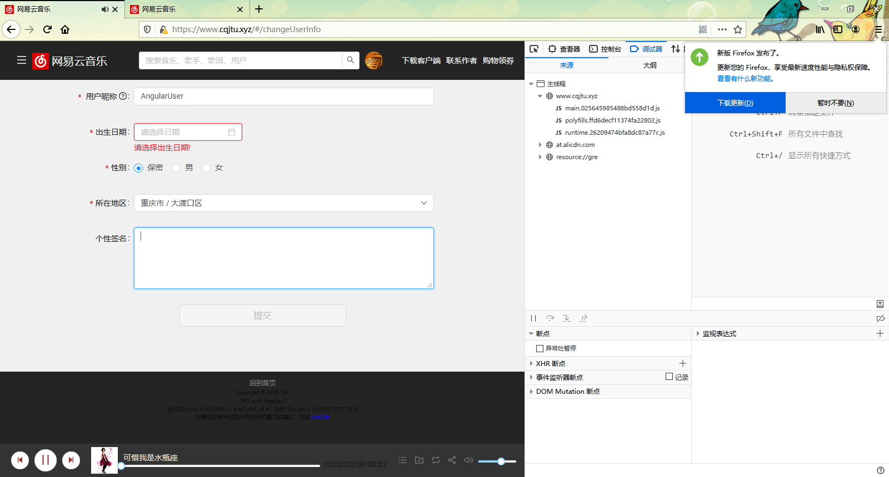
 
搜索
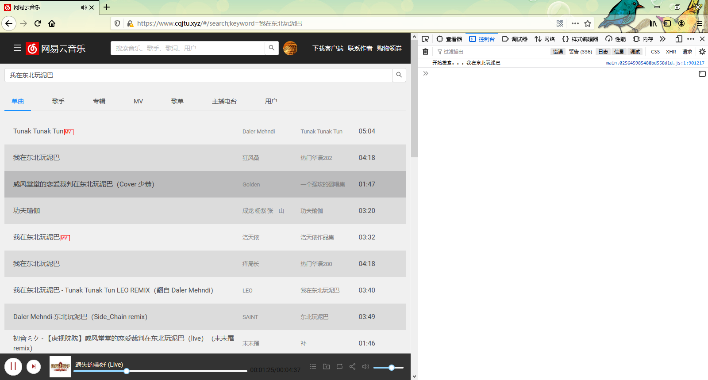
